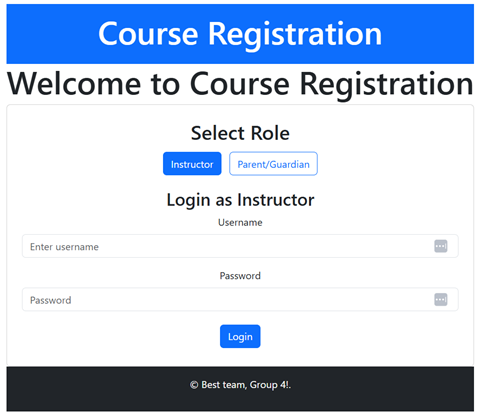
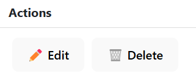
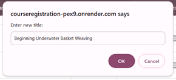
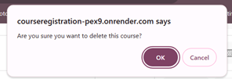
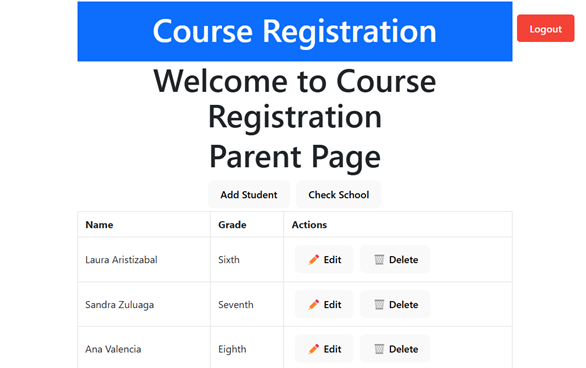
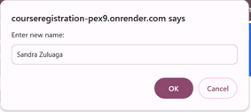
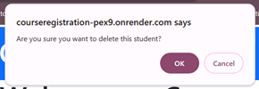
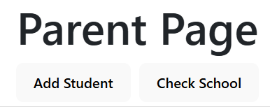
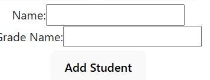

# [Course Registration](https://courseregistration-pex9.onrender.com/login)

## Description

Working parents struggle to support their children.  Single parents and households where both parents work struggle to support their kids before and after school. Add daycare, afterschool enrichment, rec centers, camps to the mix and parents are overwhelmed. Having one place online where parents can sign their children up for outside schooltime activities helps immensely.

This is why we have developed Course Registration, a centralized, easy-to-use application for signing children up for before and afterschool activities.  Parents can login, manage their family’s data and sign their children up for available activities based on their location.

This application provides a starting point for providing a valuable for before and after school providers to offer activities for enrollment and for families to conveniently view available activities and enroll their children.
This project allowed us to learn about selecting technologies to construct a full stack application and how to integrate them as seamlessly as possible. 

## Table of Contents

- [Technologies Used](#technologies-used)
- [Installation](#installation)
- [Usage](#usage)
- [Authors](#authors-🔑)
- [Built With](#built-with-🌱)

## Technologies Used
### Client and Server 
- Typescript
### Client
- Bootstrap
- Json Web Tokens
- React - Including React Dom and React client side routing
### Server
- PostgreSQL (pg)
- Sequelize
- Bcrypt - used with Sequelize
- Cors
- Express with node
### API
- Google maps API
## Installation
### 1. Install PostgreSQL
If you don't already have PostgreSQL installed, install PostgreSQL using this guide:
[PostgreSQL Installation Guide](https://coding-boot-camp.github.io/full-stack/postgresql/postgresql-installation-guide#install-postgresql-server)

To download and set up your full-stack application from a GitHub repository for development and testing, follow these steps:

### 2. Clone the Repository
1. Open a terminal or a command prompt 
2. Navigate to the <ROOT> directory where you wish to clone the repository:
`cd path/to/<Root>`
3. Clone the repository using git: 
`git clone https://github.com/laristizabal02/courseRegistration`
4. Change into the new repository direcory: `cd courseRegistration`
### 3. Install Dependencies
- Having node.js installed is a prerequisite.
- After verifying that node.js is installed: `npm install`
### 4. Set Up your <ROOT>/server/.env file 
- Supply your own values for DB_NAME, DB_USER, DB_PASSWORD,and JWT_SECRET_KEY 
`DB_NAME=course_registration
DB_USER=postgres
DB_PASSWORD=password
JWT_SECRET_KEY=TypeYourSecretHere`

### Build the application
`npm run render-build && npm run client:build  && npm run seed`

### Start the Application
`npm run server  && npm run seed`

### Test in Development
`In a browser window navigate to http://localhost:3001/`

## Usage
To run in production:
- Click on the link: [Course Registration](https://courseregistration-pex9.onrender.com/)
- This displays the Course Registration Login screen.

  

### Two Login Types:
#### Instructor Username: Dr.Science Password: password
1. Enter the username and password.
2. Click the "Login" Button.
3. The Instructor Dashboard displays.

   

4. To edit a course:
   - Click on the edit icon next to the course title and department.
   
     

   - Answer the nrw title prompt.
     
     

5. To delete a course, confirm the deletion prompt.
     
     

6. To add a new course, click on the "Add New Course" button.
     
     

---
#### Parent/Guardian Username: SuperMom Password: password
1. Enter the username and password.
2. Click the "Login" Button.
3. The Parent Dashboard displays.

   

4. To edit a student:
   - Click on the edit icon next to the student name and grade.
   
     

   - Answer the name and grade prompts.
     
     

5. To delete a student, confirm the deletion prompt.
     
     

6. To add a new student, click on the "Add Student" button.
     
    

- Fill in the name and grade fields, then click "Add Student" button below the name and grade fiels.

     
     

7. To view nearby schools, click on the "Check School" button.
    
    

8. To logout, Click on the logout button:
    

## Authors 🔑

System Architects:
1. Laura Aristizabal [Laura's GitHub Account](https://github.com/laristizabal02)
2. Steven Gray [Steven's GitHub Account](https://github.com/SparkKids) 

## License

This project is licensed under the MIT License © 2025 Laura Aristizabal and Steven Gray . See the [LICENSE](LICENSE) file for details.

---

## Built With 🌱
### Client and Server 

### Client

### Server

### API

